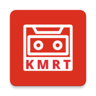

# KMRT Radio

<!-- 
 -->

A React Native app available on the <a href="https://apps.apple.com/us/app/kmrt-radio/id6449472751">Apple App Store</a>, and the <a href="https://play.google.com/store/apps/details?id=com.kmartradio">Google Play Store</a>. You can also download the app APK directly from <a href="https://github.com/aburdiss/KmrtRadio/releases">Github</a>.

This app provides a retro interface and streams old in-store Kmart tapes.

## Requirements

- iOS 12.4+
- Android SDK 21 (Android 5.0 Lollipop)

## Contributing

If you have feature requests or bug reports, feel free to help out by sending pull requests or by [creating new issues](https://github.com/aburdiss/KmartRadio/issues/new).

## License

"KMRT Radio" is released under the MIT license. See [LICENSE](LICENSE) for details.
